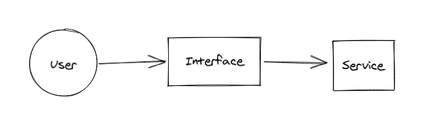
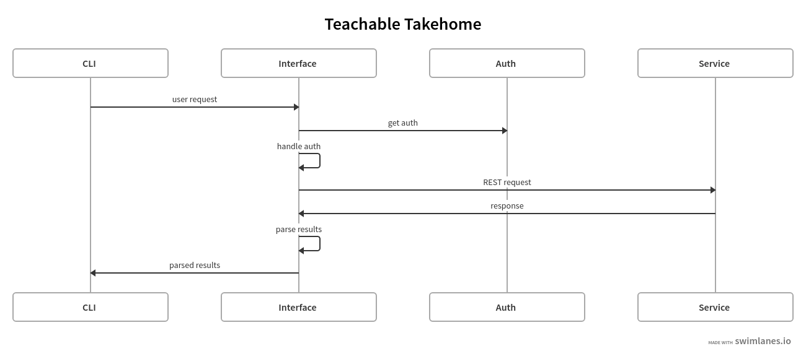
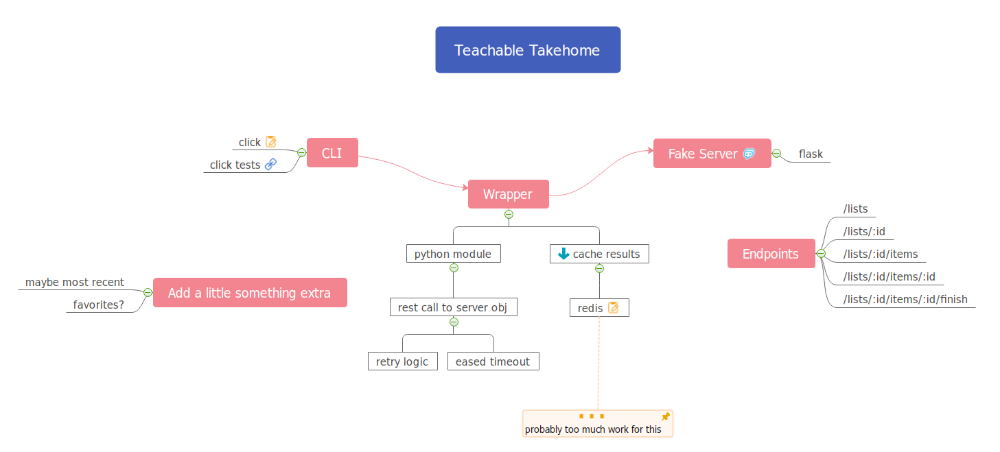

# Teachable Takehome

## The plan

1. create rough idea of what should happen to determine success

2. create interface to call provided methods

3. create quick fake response

4. attempt live call

## Rough idea of success

### Part 1: Create a list

1. Create a list

2. Get that list

3. Add an item to the list

4. Get that Item

### Part 2: Modify the list

1. Update the list name

2. Check that the old list name no longer exists

3. Get the renamed list

4. Check that the same items are there 

### Part  3: Modify an item

:warning: TODO

### Part 4: Delete

1. Create a list

2. Delete that list

### Part 5: Beyond

:warning: TODO

---

## The Interface

The interface will be [Python's click library](https://click.palletsprojects.com/en/7.x/). This is a simple CLI and should be easy to setup for this case.

This CLI will call methods in `interface.py` that will then make the REST requests.

## What is done

* Created CLI
  
  * Using Click in `cli.py`

* Implemented API calls through interface
  
  * In `interface.py`
  
  * get lists
  
  * get list
  
  * create list
  
  * create list item

* A mock backend service
  
  * using flask in `fake_list_service.py`
* Sample `runner.py` to call live API
  
  

## What is not done

* Not all API calls are included

* Custom retry logic

* Auth failure handling

* Cache auth
  Currently I am re-authenticating every time.
  Instead I should cache this until expiration and probably eject auth on expiration.

* Caching of results / ids

* Error handling

